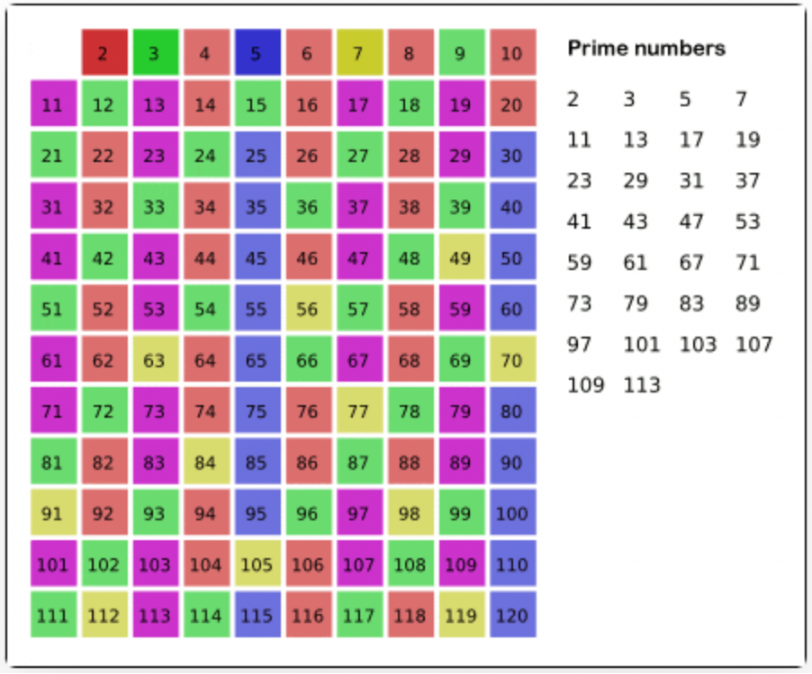

# 素数筛选法

素数(质数)是指在大于1的自然数中，除了1和它本身以外不再有其他因数的自然数

首先从 2 开始， 2 是一个素数，那么 2 × 2 = 4, 3 × 2 = 6, 4 × 2 = 8... 都不可能是素数了。

然后 3 也是素数，那么 3 × 2 = 6, 3 × 3 = 9, 3 × 4 = 12... 也都不可能是素数了。

以此类推



## 题目

```text
计数质数
给定整数 n ，返回 所有小于非负整数 n 的质数的数量。

示例 1：
输入：n = 10
输出：4
解释：小于 10 的质数一共有 4 个, 它们是 2, 3, 5, 7 。

示例 2：
输入：n = 0
输出：0

示例 3：
输入：n = 1
输出：0
```

## 基础解法

```java
/**
 * 素数筛选法 - 初始版
 */
public int original(int n) {
    boolean[] isPrime = new boolean[n];
    // 将数组都初始化为 true
    Arrays.fill(isPrime, true);
    for (int i = 2; i < n; i++) {
        if (isPrime[i]) {
            // i 的倍数不可能是素数了
            for (int j = 2 * i; j < n; j += i) {
                isPrime[j] = false;
            }
        }
    }
    int count = 0;
    for (int i = 2; i < n; i++) {
        if (isPrime[i]) count++;
    }
    return count;
}
```

## 优化解法

isPrime 函数，由于因子的对称性，其中的 for 循环只需要遍历 [2,sqrt(n)] 就够了。

这里也是类似的，我们外层的 for 循环也只需要遍历到 sqrt(n)。

除此之外，很难注意到内层的 for 循环也可以优化，基础做法是：把 i 的整数倍都标记为 false，但是仍然存在计算冗余。

比如 n = 25，i = 5 时算法会标记 5 × 2 = 10，5 × 3 = 15 等等数字，但是这两个数字已经被 i = 2 和 i = 3 的 2 × 5 和 3 × 5 标记了。

我们可以稍微优化一下，让 j 从 i 的平方开始遍历：

```java
/**
 * 素数筛选法 - 优化版
 */
public int countPrimes(int n) {
    boolean[] isPrime = new boolean[n];
    // 将数组都初始化为 true
    Arrays.fill(isPrime, true);
    for (int i = 2; i * i < n; i++)
        if (isPrime[i]) {
            // i 的倍数不可能是素数了
            for (int j = i * i; j < n; j += i) {
                isPrime[j] = false;
            }
        }
    int count = 0;
    for (int i = 2; i < n; i++) {
        if (isPrime[i]) count++;
    }
    return count;
}
```

