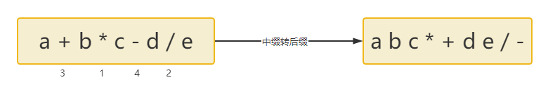
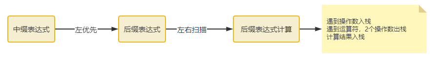

# 中缀表达式

## 一 中缀表达式计算

需要用到两个栈：操作数栈1，运算符栈2

计算步骤：

1. 操作数入栈1，运算符入栈2；
2. 运算符入栈2时，先进行运算符优先级比较；
   1. 若是要入栈的运算符 大于 栈顶运算符的优先级，入栈2
   2. 若是小于或等于栈顶运算符的优先级，依次弹出栈2运算符
      1. 每次弹出时，栈1弹出两个操作数，进行运算
      2. 结果入操作数栈1

## 二 中缀转后缀（手动模拟）

- 中缀转后缀，遵循左优先原则
- 左优先原则，相同运算符等级，从左边的运算符开始

- 

- 左右扫描，后缀计算，遇到操作数入栈，遇到运算符，2个操作数出栈，计算结果入栈
- 

## 三 思路

核心方法：

1. 定义两个栈：操作数栈 `operands` 和运算符栈 `operators`
2. 遍历中缀表达式
3. 遇到数字时，解析整个数字，入操作数栈
4. 遇到运算符时
   1. 当前运算符优先级 <= 栈顶运算符优先级，则弹出操作数栈的两个操作数和运算符栈的栈顶运算符进行计算，然后将结果入操作数栈
   2. 当前运算符优先级 > 栈顶运算符优先级，则将当前运算符入运算符栈
5. 遇到括号时
   1. 左括弧，直接入运算符栈
   2. **右括号，则计算直到遇到左括号**

6. 处理剩余的运算符
7. 返回操作数栈的栈顶元素

辅助方法：
- isOperator：判断是否是运算符
- precedence：判断运算符的优先级
- compute：计算两个操作数和运算符

## 四 代码实现

```java
public class InfixExpressionCalculator {

    /**
     * 中缀表达式计算
     */
    public static int calculate(String expression) {
        // 移除所有空格
        expression = expression.replaceAll("\\s+", "");

        Stack<Integer> operands = new Stack<>();  // 操作数栈
        Stack<Character> operators = new Stack<>(); // 运算符栈

        int i = 0;
        int n = expression.length();

        while (i < n) {
            char c = expression.charAt(i);
            // 1.如果是数字，解析整个数字
            if (Character.isDigit(c)) {
                int num = 0;
                while (i < n && Character.isDigit(expression.charAt(i))) {
                    num = num * 10 + (expression.charAt(i) - '0');
                    i++;
                }
                operands.push(num);
                continue; // 已经处理了数字，不需要再i++
            }
            // 2.如果是运算符
            else if (isOperator(c)) {
                // 当前运算符优先级 <= 栈顶运算符优先级时，先计算栈顶的
                while (!operators.isEmpty() && precedence(c) <= precedence(operators.peek())) {
                    compute(operands, operators);
                }
                operators.push(c); // 当前运算符入栈
            }
            // 3.如果是左括号，直接入栈
            else if (c == '(') {
                operators.push(c);
            }
            // 4.如果是右括号，计算直到遇到左括号
            else if (c == ')') {
                while (!operators.isEmpty() && operators.peek() != '(') {
                    compute(operands, operators);
                }
                operators.pop(); // 弹出左括号
            }
            i++; // 移动到下一个字符
        }

        // 处理剩余的所有运算符
        while (!operators.isEmpty()) {
            compute(operands, operators);
        }

        return operands.pop();
    }

    // 计算函数：弹出两个操作数和一个运算符，计算结果并入栈
    private static void compute(Stack<Integer> operands, Stack<Character> operators) {
        if (operands.size() < 2 || operators.isEmpty()) {
            return;
        }

        int b = operands.pop(); // 第二个操作数（右操作数）
        int a = operands.pop(); // 第一个操作数（左操作数）
        char op = operators.pop();

        int result = 0;
        switch (op) {
            case '+':
                result = a + b;
                break;
            case '-':
                result = a - b;
                break;
            case '*':
                result = a * b;
                break;
            case '/':
                if (b == 0) throw new ArithmeticException("Division by zero");
                result = a / b;
                break;
        }
        operands.push(result);
    }

    // 判断是否是运算符
    private static boolean isOperator(char c) {
        return c == '+' || c == '-' || c == '*' || c == '/';
    }

    // 定义运算符优先级
    private static int precedence(char op) {
        switch (op) {
            case '+':
            case '-':
                return 1;
            case '*':
            case '/':
                return 2;
            case '(':
                return 0; // 左括号优先级最低
            default:
                return -1;
        }
    }

    // 测试代码
    public static void main(String[] args) {
        String[] testCases = {
                "3 + 4 * 2",
                "(3 + 4) * 2",
                "10 - 6 / 2",
                "2 * (3 + 4 * 2) - 5",
                "1 + 2 * 3 - 4 / 2"
        };
        for (String test : testCases) {
            int result = calculate(test);
            System.out.println(test + " = " + result);
        }
    }
}
```

## 五 算法特点

- **时间复杂度**：O(n)，每个字符只处理一次
- **空间复杂度**：O(n)，使用两个栈存储
- **支持功能**：四则运算、括号、运算符优先级

## 六 详细执行过程分析

以表达式 `"3 + 4 * 2"` 为例：

**步骤分解：**

1. **读取 '3'**
   - 操作数栈: [3]
   - 运算符栈: []
2. **读取 '+'**
   - 运算符栈为空，直接入栈
   - 操作数栈: [3]
   - 运算符栈: [+]
3. **读取 '4'**
   - 操作数栈: [3, 4]
   - 运算符栈: [+]
4. **读取 '\*'**
   - 比较优先级：`*`(2) > `+`(1)，直接入栈
   - 操作数栈: [3, 4]
   - 运算符栈: [+, *]
5. **读取 '2'**
   - 操作数栈: [3, 4, 2]
   - 运算符栈: [+, *]
6. **表达式结束，处理剩余运算符**
   - 弹出 `*`，计算 `4 * 2 = 8`
   - 操作数栈: [3, 8]
   - 运算符栈: [+]
   - 弹出 `+`，计算 `3 + 8 = 11`
   - 操作数栈: [11]
   - 运算符栈: []

**最终结果: 11**