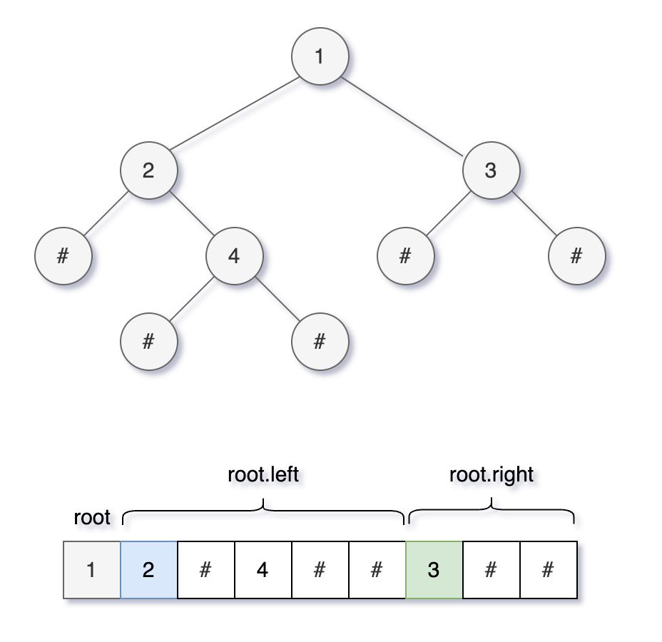
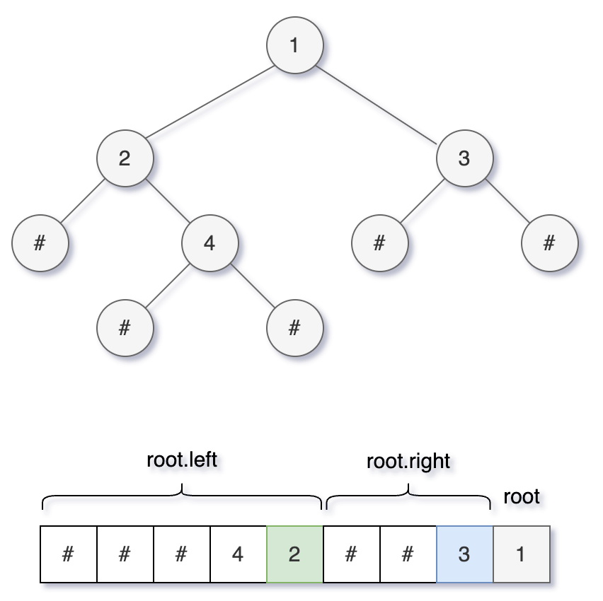
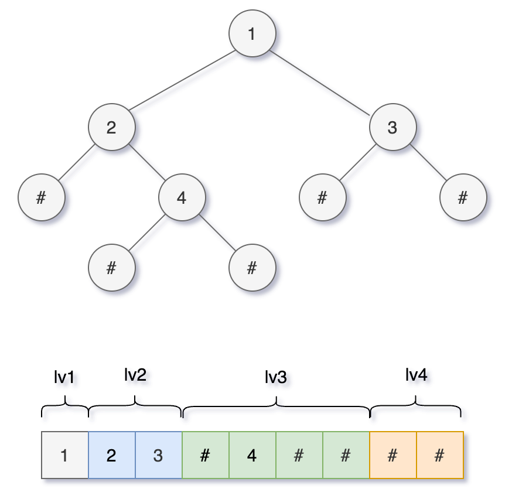

# 序列化

## 一 前/中/后序和二叉树的唯一性

### 反序列化出唯一的一棵二叉树

**当二叉树中节点的值不存在重复时：**

1. 序列化结果中**不包含空指针**：
   1. 一种遍历顺序，无法还原。
   2. **两种**遍历顺序，两种情况：
      1. **前序和中序、中序和后序**：**可以还原**出唯一的一棵二叉树；
      2. **前序和后序**：**无法还原**。

2. 序列化结果中**包含空指针**，**一种**遍历顺序，两种情况：
   1. **前序或后序**：**可以还原**出唯一的一棵二叉树；
   2. **中序**：**无法还原**。

### 打平

所谓的序列化不过就是把结构化的数据「打平」，本质就是在考察二叉树的遍历方式。

## 二 前序遍历解法

**序列化**

- 前序遍历将二叉树打平为字符串；
- 用  `,`  作为分隔符，用  `#`  表示空指针。

**反序列化**

有空指针，前序可以还原出唯一的一棵二叉树：

1. 将字符串转为集合nodes，反序列化；
2. 先确定根节点 root，然后遵循前序遍历规则，递归生成左右子树即可；
3. 根据树的递归性质，nodes 列表的**第一个元素**是一棵树的根节点，所以只要将列表的第一个元素取出作为根节点，剩下的交给递归函数去解决即可。

**代码实现**

```java
// 代表分隔符的字符
private final String SEP = ",";
// 代表 null 空指针的字符
private final String NULL = "#";
// 用于拼接字符串
private final StringBuilder sb = new StringBuilder();

public String serialize(TreeNode root) {
    preSerialize(root);
    return sb.toString();
}
/**
 * 序列化
 * 将二叉树打平为字符串
 */
public void preSerialize(TreeNode root) {
    if (root == null) {
        sb.append(NULL).append(SEP);
        return;
    }
    // 前序位置
    sb.append(root.val).append(SEP);
    preSerialize(root.left);
    preSerialize(root.right);
}


public TreeNode deserialize(String data) {
    LinkedList<String> nodes = new LinkedList<>();
    // 字符串转为集合
    Collections.addAll(nodes, data.split(SEP));
    return preDeserialize(nodes);
}
/**
 * 反序列化
 * 有空指针，前序和后序可以还原出唯一的一棵二叉树
 * 先确定根节点 root，然后遵循前序遍历的规则，递归生成左右子树即可
 */
public TreeNode preDeserialize(LinkedList<String> nodes) {
    if (nodes.isEmpty()) {
        return null;
    }
    // 前序位置
    // 列表最左侧就是根节点
    String first = nodes.removeFirst();
    if (first.equals(NULL)) {
        return null;
    }
    // 构建根节点
    TreeNode root = new TreeNode(Integer.parseInt(first));
    // 递归构建左右子树
    root.left = preDeserialize(nodes);
    root.right = preDeserialize(nodes);
    return root;
}
```



## 三 后序遍历解法

**序列化**：

1. 后序遍历将二叉树打平为字符串；
2. 用  `,`  作为分隔符，用  `#`  表示空指针。

**反序列化**：

1. 有空指针，**后序**可以还原出唯一的一棵二叉树；
2. 将字符串转为集合`nodes` ，反序列化；
3. 先确定根节点 `root`（最后一个节点），然后遵循前序遍历的规则，递归生成右、左子树即可；
4. 根据下图，**从后往前**在 `nodes` 列表中取元素，**先构造右子树，后构造左子树。**

**代码实现**

```java
// 代表分隔符的字符
private String SEP = ",";
// 代表 null 空指针的字符
private String NULL = "#";
// 用于拼接字符串
private StringBuilder sb = new StringBuilder();

public String serialize(TreeNode root) {
    postSerialize(root);
    return sb.toString();
}

/**
 * 序列化
 * 将二叉树打平为字符串
 */
public void postSerialize(TreeNode root) {
    if (root == null) {
        sb.append(NULL).append(SEP);
        return;
    }
    postSerialize(root.left);
    postSerialize(root.right);
    // 后序位置
    sb.append(root.val).append(SEP);
}


public TreeNode deserialize(String data) {
    LinkedList<String> nodes = new LinkedList<>();
    // 字符串转为集合
    Collections.addAll(nodes, data.split(SEP));
    return postDeserialize(nodes);
}

/**
 * 反序列化
 * 有空指针，前序和后序可以还原出唯一的一棵二叉树
 * 先确定根节点 root，然后遵循后序遍历的规则，递归生成左右子树即可
 */
public TreeNode postDeserialize(LinkedList<String> nodes) {
    if (nodes.isEmpty()) {
        return null;
    }
    // 后序遍历，从后往前取出元素，最后一个节点是根节点
    String last = nodes.removeLast();
    if (last.equals(NULL)) {
        return null;
    }
    // 构建根节点
    TreeNode root = new TreeNode(Integer.parseInt(last));
    // 根节点左侧节点是右子树
    // 递归构建 ，先构造右子树，后构造左子树
    root.right = postDeserialize(nodes);
    root.left = postDeserialize(nodes);
    return root;
}
```




## 四 中序遍历解法

- 序列化，只要把字符串的拼接操作放到中序遍历的位置即可。
- 无法实现反序列化方法。

**代码实现**

```java
// 代表分隔符的字符
private final String SEP = ",";
// 代表 null 空指针的字符
private final String NULL = "#";
// 用于拼接字符串
private final StringBuilder sb = new StringBuilder();
public String serialize(TreeNode root) {
    inSerialize(root);
    return sb.toString();
}
/**
 * 序列化
 * 将二叉树打平为字符串
 */
public void inSerialize(TreeNode root) {
    if (root == null) {
        sb.append(NULL).append(SEP);
        return;
    }
    inSerialize(root.left);
    // 中序位置
    sb.append(root.val).append(SEP);
    inSerialize(root.right);
}
```

## 五 层级遍历解法

**序列化**：层级遍历将二叉树打平为字符串

1. 用  `,`  作为分隔符，用  `#`  表示空指针；
2. 从上到下，从左到右；
3. 同时记录空指针。

**反序列化**：用队列进行层级遍历，同时用索引 `index` 记录对应子节点的位置

    1. 将字符串转为集合`nodes` ，反序列化；
    2. 通过`nodes[index]` 来计算左右子节点，接到父节点上并加入队列。

**代码实现**

```java
// 代表分隔符的字符
private final String SEP = ",";
// 代表 null 空指针的字符
private final String NULL = "#";
/**
 * 序列化
 * 将二叉树打平为字符串
 */
public String levelSerialize(TreeNode root) {
    if (root == null) return "";
    // 用于拼接字符串
    StringBuilder sb = new StringBuilder();
    // 初始化队列，将 root 加入队列
    Queue<TreeNode> q = new LinkedList<>();
    q.offer(root);
    // 从上到下
    while (!q.isEmpty()) {
        int sz = q.size();
        // 从左到右
        for (int i = 0; i < sz; i++) {
            TreeNode cur = q.poll();
            if (cur == null) {
                sb.append(NULL).append(SEP);
                continue;
            }
            sb.append(cur.val).append(SEP);
            // 队列添加同层节点，空指针也会添加
            q.offer(cur.left);
            q.offer(cur.right);
        }
    }
    return sb.toString();
}


/**
 * 反序列化
 * 字符串反序列化为二叉树结构
 */
public TreeNode levelDeserialize(String data) {
    if (data.isEmpty()) return null;
    String[] nodes = data.split(SEP);
    // 第一个元素就是 root 的值
    TreeNode root = new TreeNode(Integer.parseInt(nodes[0]));
    Queue<TreeNode> q = new LinkedList<>();
    // 队列 q 记录父节点，将 root 加入队列
    q.offer(root);
    // index 变量记录正在序列化的节点在数组中的位置
    int index = 1;
    while (!q.isEmpty()) {
        int sz = q.size();
        for (int i = 0; i < sz; i++) {
            TreeNode parent = q.poll();
            // 为父节点构造 左侧子节点
            String left = nodes[index++];
            if (!left.equals(NULL)) {
                parent.left = new TreeNode(Integer.parseInt(left));
                q.offer(parent.left);
            }
            // 为父节点构造 右侧子节点
            String right = nodes[index++];
            if (!right.equals(NULL)) {
                parent.right = new TreeNode(Integer.parseInt(right));
                q.offer(parent.right);
            }
        }
    }
    return root;
}
```



## 六 例题：寻找重复的子树

给你一棵二叉树的根节点 `root` ，返回所有 **重复的子树** 。

对于同一类的重复子树，你只需要返回其中任意 **一棵** 的根结点即可。

如果两棵树具有 **相同的结构** 和 **相同的结点值** ，则认为二者是 **重复** 的。

### 示例

```
输入：root = [1,2,3,4,null,2,4,null,null,4]
输出：[[2,4],[4]]

输入：root = [2,1,1]
输出：[[1]]

输入：root = [2,2,2,3,null,3,null]
输出：[[2,3],[3]]
```

### 思路

1. 后序位置
2. 记录每个子树的序列化结果（String）
3. 统计子树序列化结果的出现次数（有重复的）
4. 找出重复子树

### 代码实现

```java
// 记录所有子树(序列化结果)以及出现的次数
public Map<String, Integer> map = new HashMap<>();
// 记录重复的子树根节点
public List<TreeNode> res = new LinkedList<>();

/**
 * 1.记录每个子树的序列化结果（String）
 * 2.统计子树序列化结果的出现次数（有重复的）
 * 3.找出重复子树
 */
public List<TreeNode> findDuplicateSubtrees(TreeNode root) {
    serialize(root);
    return res;
}
/**
 * 输入以 root 为根的二叉树，返回这棵树的序列化字符串
 */
public String serialize(TreeNode root) {
    // 对于空节点，可以用一个特殊字符表示
    if (root == null) {
        return "#";
    }
    // 将左、右子树序列化成字符串
    String left = serialize(root.left);
    String right = serialize(root.right);
    // 后序遍历代码位置
    // 左、右子树加上自己，就是以自己为根的二叉树序列化结果
    String myself = left + "," + right + "," + root.val;
    int freq = map.getOrDefault(myself, 0);
    // 多次重复也只会被加入结果集一次
    if (freq == 1) {
        res.add(root);
    }
    // 给子树对应的出现次数加一
    map.put(myself, freq + 1);
    return myself;
}
```

