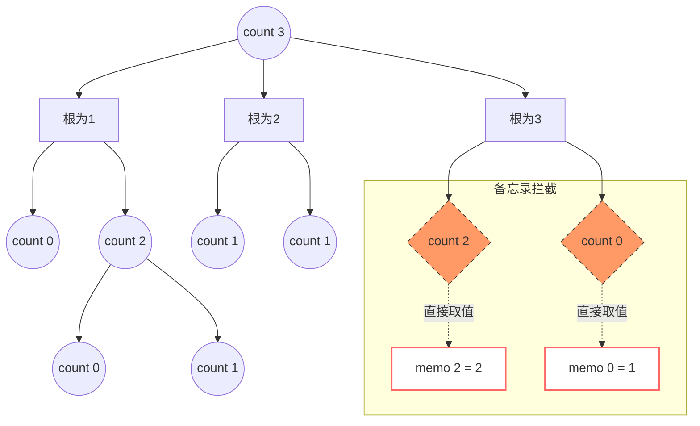
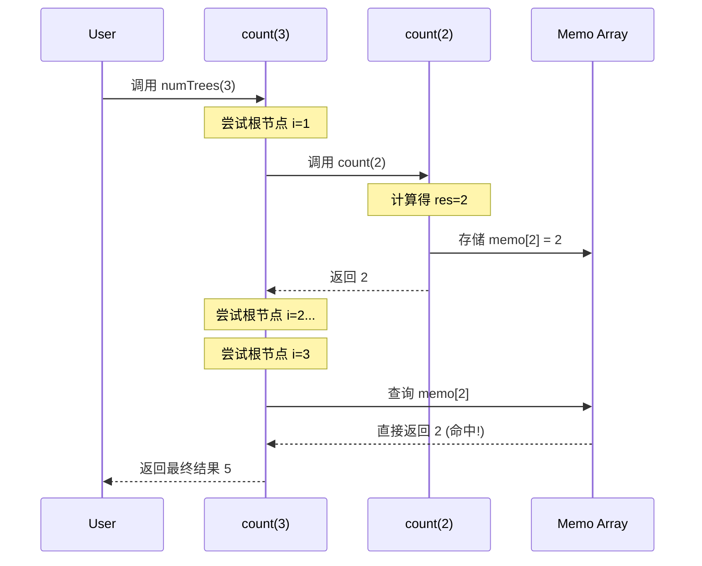

# 二叉搜索树

BST 的**中序遍历**结果是有序的（升序）。

- 左、右子树遍历**升序**；
- 右、左子树遍历**降序**。

## 操作

BST 相关问题的代码逻辑：

```java
public void bst(TreeNode root, int target) {
    if (root.val == target) {
        // TODO 操作
    }
    bst(root.left, target);
    bst(root.right, target);
}
```

常见操作

1. 判断 BST 的合法性
2. 在 BST 中搜索元素
3. 在 BST 中插入一个数
4. 在 BST 中删除一个数

## 题目：不同的二叉搜索树

给你一个整数 `n` ，求恰由 `n` 个节点组成且节点值从 `1` 到 `n` 互不相同的 **二叉搜索树** 有多少种？返回满足题意的二叉搜索树的种数。

### 1.带备忘录的递归

为了直观理解**带备忘录的递归（Top-down with Memoization）**是如何工作的，我们可以通过 $n=3$ 的情况来拆解。

#### 1. 递归树与问题分解

当我们调用 `count(3)` 时，函数会尝试让每一个数字（1, 2, 3）轮流当根节点。

- **根为 1**：左边 $0$ 个节点，右边 $2$ 个节点 $\rightarrow$ 调用 `count(0)` 和 `count(2)`
- **根为 2**：左边 $1$ 个节点，右边 $1$ 个节点 $\rightarrow$ 调用 `count(1)` 和 `count(1)`
- **根为 3**：左边 $2$ 个节点，右边 $0$ 个节点 $\rightarrow$ 调用 `count(2)` 和 `count(0)`

------

#### 2. 备忘录的作用：剪枝过程

在普通的递归中，`count(2)` 会被计算两次。但在**带备忘录**的版本中，一旦第一次算出了 `count(2) = 2`，它就会被存入数组。

**执行流程图解：**

1. **开始 `count(3)`**:
   - 尝试 **根 = 1**:
     - 调用 `count(0)` $\rightarrow$ 返回 **1** (Base Case)
     - 调用 `count(2)`:
       - `count(2)` 内部调用 `count(0)*count(1)` + `count(1)*count(0)` = $1+1$ = **2**
       - **存入备忘录: `memo[2] = 2`**
     - 得到 $1 \times 2 = 2$
2. **继续 `count(3)`**:
   - 尝试 **根 = 2**:
     - 调用 `count(1)` $\rightarrow$ 返回 **1**
     - 调用 `count(1)` $\rightarrow$ 返回 **1**
     - 得到 $1 \times 1 = 1$
3. **继续 `count(3)`**:
   - 尝试 **根 = 3**:
     - 调用 `count(2)` $\rightarrow$ **直接从备忘录读取 `memo[2]`**, 返回 **2**（不再展开递归！）
     - 调用 `count(0)` $\rightarrow$ 返回 **1**
     - 得到 $2 \times 1 = 2$
4. **最终汇总**: $2 + 1 + 2 = 5$

------

#### 3. 递归与备忘录的状态变化

我们可以把备忘录看作一个逐渐填满的表格：

| **节点数 n**             | **0** | **1** | **2** | **3** |
| ------------------------ | ----- | ----- | ----- | ----- |
| **初始状态**             | 0     | 0     | 0     | 0     |
| **计算 count(0/1) 后**   | 1     | 1     | 0     | 0     |
| **计算 count(2) 后**     | 1     | 1     | **2** | 0     |
| **最终计算 count(3) 后** | 1     | 1     | 2     | **5** |

> **关键点：** 备忘录将原本像“树”一样发散的计算路径，压缩成了线性的“查表”路径。如果没有备忘录，随着 $n$ 增大，重复的子树（如 `count(2)`, `count(3)` 等）会呈指数级增长。

------

使用 Mermaid 流程图可以非常清晰地展现递归过程中的**分治思想**以及**备忘录（Memoization）如何拦截重复计算**。

以下是 $n=3$ 时的递归调用逻辑图：

#### 4. 递归调用与备忘录拦截图

在下图中，实线表示**执行计算**，虚线表示**直接从备忘录返回**。你可以看到 `count(2)` 和 `count(0)` 在右侧分支被“拦截”了，从而避免了深度递归。

代码段



------

#### 5. 状态转换时序图

为了更直观地理解“自顶向下”的执行顺序，我们可以看这个简化的时序：

代码段



------

### 关键点总结

- **分治（Divide and Conquer）**：每一个 `count(n)` 都被拆解为 `count(i-1) * count(n-i)`。
- **重叠子问题（Overlapping Subproblems）**：在计算 `count(3)` 的过程中，`count(2)` 会在不同的根节点场景下被多次提及。
- **备忘录（Memoization）**：
  - **第一次遇到**：计算并存入数组。
  - **后续遇到**：像上面橙色框内的一样，直接通过索引取值，时间复杂度从 $O(2^n)$ 降至 $O(n^2)$。

```java
// 备忘录数组，用于存储已经计算过的 n 个节点的 BST 数量
private int[] memo;
/**
 * 1.带备忘录的递归
 * 「自顶向下」进行「递归」求解
 */
public int numTrees(int n) {
    // 初始化备忘录，长度为 n+1 以匹配索引
    memo = new int[n + 1];
    return count(n);
}
private int count(int n) {
    // 基准情形：空树（n=0）或只有一个节点（n=1）
    // 只有 1 种排列方式
    if (n <= 1) {
        return 1;
    }
    // 查备忘录：如果已经计算过，直接返回
    if (memo[n] != 0) {
        return memo[n];
    }
    int res = 0;
    // 遍历每一个节点 i，尝试将其作为根节点
    for (int i = 1; i <= n; i++) {
        // 左子树由 i-1 个节点组成
        int left = count(i - 1);
        // 右子树由 n-i 个节点组成
        int right = count(n - i);
        // 乘法原理：总形态数 = 左子树形态数 * 右子树形态数
        res += left * right;
    }
    // 将结果存入备忘录并返回
    memo[n] = res;
    return res;
}
```


### 2.动态规划


### 3.数据公式