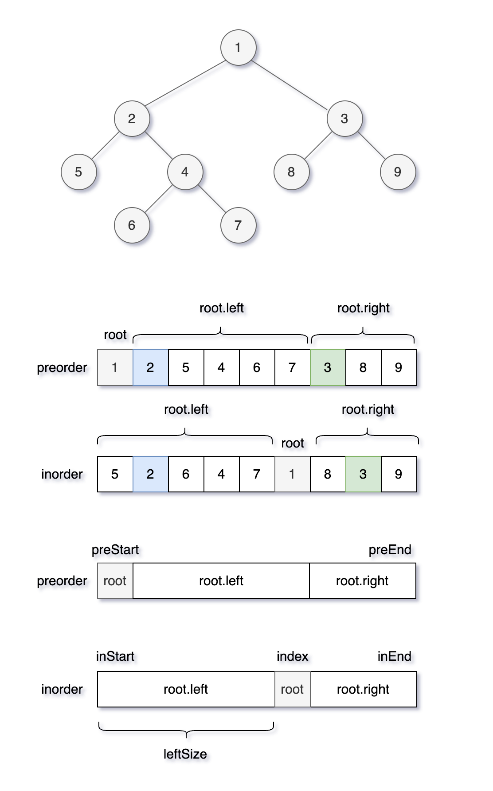
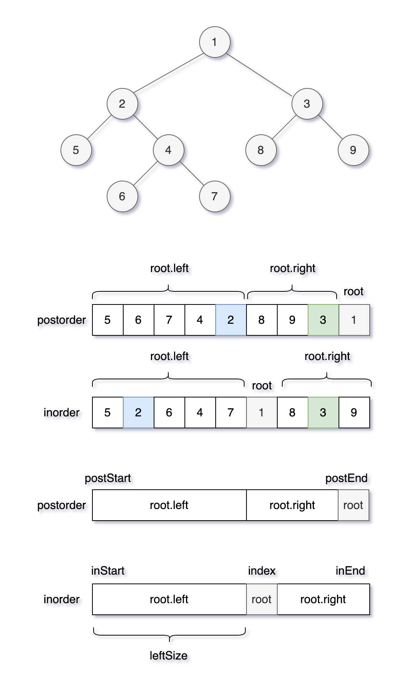

# 构造

## 思路：分解问题

二叉树的构造问题一般都是使用「分解问题」的思路：

**构造整棵树 = 根节点 + 构造左子树 + 构造右子树。**

先找出根节点，然后根据根节点的值找到左右子树的元素，进而递归构建出左右子树。

## 1.顺序存储创建二叉树

对于顺序存储的完全二叉树，如果某个节点的索引为index，其对应的左子树的索引为2*index+1，右子树为2*index+2。

```java
/**
 * 顺序存储创建二叉树
 *
 * @param array 数组
 * @param index 索引
 * @return 树
 */
public TreeNode arrayToTree(int[] array, int index) {
    // 递归终止条件
    if (index >= array.length) {
        return null;
    }
    // 值为0，则是空结点
    if (array[index] == 0) {
        return null;
    }
    // 前序遍历
    // 生成节点，值为 array[index]
    TreeNode treeNode = new TreeNode(array[index]);
    // 左子树，索引为2*index+1
    treeNode.left = arrayToTree(array, 2 * index + 1);
    // 右子树，索引为2*index+2
    treeNode.right = arrayToTree(array, 2 * index + 2);
    return treeNode;
}

// arrayToTree(array, 0)
```

## 2.构造最大二叉树

- 先构造出根节点
- 然后递归调用构造左右子树

```java
public TreeNode build(int[] nums, int low, int high) {
    // base case
    if (low > high) return null;
    // 前序位置
    // 找到数组中的最大值，及索引
    int max = nums[low];
    int index = low;
    for (int i = low + 1; i <= high; i++) {
        if (nums[i] > max) {
            max = nums[i];
            index = i;
        }
    }
    // 先构造出根节点(最大值)
    TreeNode root = new TreeNode(max);
    // 递归调用构造左右子树
    root.left = build(nums, low, index - 1);
    root.right = build(nums, index + 1, high);
    return root;
}

// build(nums, 0, nums.length - 1)
```

## 3.从前序与中序遍历序列构造二叉树

- 根据前序、中序，确定一个节点位置；
- 根据节点值找到左右子树的元素；
- 然后递归构造左右子树，传入前序、中序遍历。

```java
// 存储中序遍历的值、索引
public HashMap<Integer, Integer> indexMap = new HashMap<>();
public TreeNode buildTree(int[] preorder, int[] inorder) {
    for (int i = 0; i < inorder.length; i++) {
        // 存储 中序遍历的 值、索引
        indexMap.put(inorder[i], i);
    }
    // 根据函数定义，用 preorder 和 inorder 构造二叉树
    return build(preorder, 0, preorder.length - 1,
            inorder, 0, inorder.length - 1);
}
/**
 * 根据前序、中序，确定一个节点位置，然后递归构造左右子树
 * 前序遍历数组为 preorder[preStart..preEnd]
 * 中序遍历数组为 inorder[inStart..inEnd]
 */
public TreeNode build(int[] preorder, int preStart, int preEnd,
                      int[] inorder, int inStart, int inEnd) {
    // base case，跳出递归
    if (preStart > preEnd) return null;
    // 获取前序遍历第一个值 val
    // root.val 节点对应的值就是 val
    int val = preorder[preStart];
    // 构造根节点
    TreeNode root = new TreeNode(val);
    // 获取 val 在中序遍历的索引
    int index = indexMap.get(val);
    // 左树长度
    int leftSize = index - inStart;
    // 递归构造左右子树，传入前序、中序遍历
    root.left = build(preorder, preStart + 1, preStart + leftSize,
            inorder, inStart, index - 1);
    root.right = build(preorder, preStart + leftSize + 1, preEnd,
            inorder, index + 1, inEnd);
    return root;
}
```



## 4.从中序与后序遍历序列构造二叉树

- 根据中序、后序，确定一个节点位置；
- 根据节点值找到左右子树的元素；
- 然后递归构造左右子树，传入中序、后序遍历。

```java
// 存储中序遍历的值、索引
HashMap<Integer, Integer> indexMap = new HashMap<>();
public TreeNode buildTree(int[] inorder, int[] postorder) {
    for (int i = 0; i < inorder.length; i++) {
        indexMap.put(inorder[i], i);
    }
    return build(inorder, 0, inorder.length - 1,
            postorder, 0, postorder.length - 1);
}
/**
 * build 函数的定义：
 * 中序遍历数组为 inorder[inStart..inEnd]，
 * 后序遍历数组为 postorder[postStart..postEnd]，
 * 构造二叉树，返回该二叉树的根节点
 */
public TreeNode build(int[] inorder, int inStart, int inEnd,
                      int[] postorder, int postStart, int postEnd) {
    // base case，跳出递归
    if (inStart > inEnd) return null;
    // val为后序遍历的最后一个值
    int val = postorder[postEnd];
    // root.val 节点对应的值就是 val
    TreeNode root = new TreeNode(val);
    // 找到 val在中序遍历的 索引
    int index = indexMap.get(val);
    // 左子树的节点个数
    int leftSize = index - inStart;
    // 递归构造左右子树
    root.left = build(inorder, inStart, index - 1,
            postorder, postStart, postStart + leftSize - 1);
    root.right = build(inorder, index + 1, inEnd,
            postorder, postStart + leftSize, postEnd - 1);
    return root;
}
```




## 5.根据前序和后序遍历构造二叉树