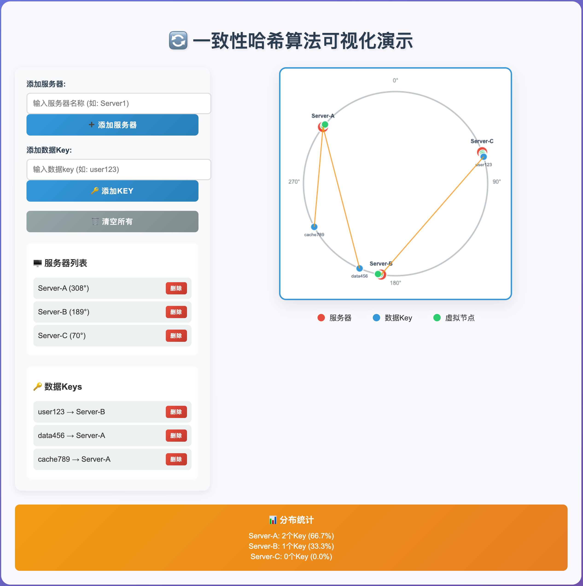

# 一致性哈希算法

## 1. 背景与问题

### 传统哈希的问题

在分布式系统中，传统的哈希分片方式是：`hash(key) % N`（N为服务器数量）

**问题**：当服务器数量变化时，几乎所有数据的映射关系都会改变，导致大量数据重新分布，这在分布式缓存中是灾难性的。

### 举例说明

假设有3台服务器，key="user123"：

- 初始：`hash("user123") % 3 = 1`，数据在服务器1
- 增加1台服务器：`hash("user123") % 4 = 2`，数据需迁移到服务器2
- 失效率高达75%！

## 2. 一致性哈希原理

### 核心思想

将哈希空间组织成一个虚拟的圆环（Hash Ring），而不是线性空间。

### 基本步骤

1. **构建哈希环**：将哈希值空间[0, 2^32-1]首尾相接形成圆环
2. **服务器映射**：将每台服务器通过哈希函数映射到环上的某个点
3. **数据映射**：将数据key通过哈希函数映射到环上
4. **查找规则**：沿顺时针方向找到第一台服务器## 3. 虚拟节点（Virtual Nodes）

### 问题

仅使用物理节点可能导致数据分布不均匀，特别是节点较少时。

### 解决方案

为每个物理节点创建多个虚拟节点，分布在环的不同位置。

### 实现方式

```python
# 为服务器server1创建虚拟节点
for i in range(virtual_nodes_count):
    virtual_name = f"server1#{i}"
    hash_value = hash(virtual_name) % (2**32)
    # 将虚拟节点添加到环上
```

## 4. 算法优势

### 1. 最小化数据迁移

- 添加节点：只影响一个区间的数据
- 删除节点：只需迁移该节点的数据到下一个节点
- 平均只需迁移 K/N 的数据（K为总数据，N为节点数）

### 2. 负载均衡

- 虚拟节点确保数据分布均匀
- 可以根据服务器性能设置不同数量的虚拟节点

### 3. 容错性

- 单个节点故障只影响局部数据
- 系统可以继续正常运行

## 5. 实际应用场景

### 分布式缓存

- **Redis Cluster**：使用一致性哈希分片
- **Memcached**：客户端实现一致性哈希
- **Amazon DynamoDB**：内部使用类似机制

### 分布式存储

- **Cassandra**：使用一致性哈希进行数据分区
- **Amazon S3**：内部分区机制
- **Ceph**：CRUSH算法基于一致性哈希

### CDN内容分发

- 根据用户地理位置和内容哈希分配边缘节点

### 微服务负载均衡

- 服务实例的动态扩缩容
- 保持客户端会话亲和性

## 6. 算法局限性

### 1. 数据热点

- 某些key访问频率很高时，仍可能造成负载不均

### 2. 范围查询困难

- 不支持按key范围进行查询操作

### 3. 实现复杂度

- 相比简单哈希，实现和维护更复杂

### 4. 元数据开销

- 需要维护环的状态信息

## 7. 优化策略

### 1. 有界负载一致性哈希

限制单个节点的最大负载，超过阈值时重新分配

### 2. 加权一致性哈希

根据服务器性能分配不同数量的虚拟节点

### 3. 动态虚拟节点调整

根据实际负载情况动态增减虚拟节点

## 8. 代码实现

```java
import java.security.MessageDigest;
import java.security.NoSuchAlgorithmException;
import java.util.*;

/**
 * @author: lubanban1
 * @date: 2025/9/4 10:28
 * @description: <p>
 *
 */

public class ConsistentHash<T> {
    // 哈希函数，用于计算节点和键的哈希值
    private final HashFunction hashFunction;

    // 每个真实节点对应的虚拟节点数量
    private final int numberOfReplicas;

    // 哈希环，使用TreeMap实现有序的哈希环
    private final TreeMap<Long, T> circle = new TreeMap<>();

    // 真实节点到虚拟节点映射的缓存
    private final Map<T, List<Long>> nodeToReplicas = new HashMap<>();

    /**
     * 默认构造函数，使用MD5哈希，虚拟节点数为160
     */
    public ConsistentHash() {
        this(new MD5Hash(), 160);
    }

    /**
     * 构造函数
     *
     * @param hashFunction     哈希函数
     * @param numberOfReplicas 每个真实节点的虚拟节点数
     */
    public ConsistentHash(HashFunction hashFunction, int numberOfReplicas) {
        this.hashFunction = hashFunction;
        this.numberOfReplicas = numberOfReplicas;
    }

    /**
     * 添加节点到哈希环
     *
     * @param node 节点
     */
    public void add(T node) {
        // 为每个真实节点创建虚拟节点
        List<Long> replicas = new ArrayList<>();
        for (int i = 0; i < numberOfReplicas; i++) {
            // 虚拟节点名称格式: node#0, node#1, ...
            String virtualNodeName = node.toString() + "#" + i;
            long hash = hashFunction.hash(virtualNodeName);
            circle.put(hash, node);
            replicas.add(hash);
        }
        nodeToReplicas.put(node, replicas);
    }

    /**
     * 从哈希环中移除节点
     *
     * @param node 节点
     */
    public void remove(T node) {
        List<Long> replicas = nodeToReplicas.remove(node);
        if (replicas != null) {
            for (Long hash : replicas) {
                circle.remove(hash);
            }
        }
    }

    /**
     * 根据键获取对应的节点
     *
     * @param key 键
     * @return 节点
     */
    public T get(Object key) {
        if (circle.isEmpty()) {
            return null;
        }
        long hash = hashFunction.hash(key.toString());

        // 使用TreeMap的ceilingEntry方法找到第一个大于等于该哈希值的节点
        Map.Entry<Long, T> entry = circle.ceilingEntry(hash);

        // 如果没找到，则使用第一个节点（环状结构）
        if (entry == null) {
            entry = circle.firstEntry();
        }

        return entry.getValue();
    }

    /**
     * 获取哈希环中的节点数量（真实节点）
     *
     * @return 节点数量
     */
    public int size() {
        return nodeToReplicas.size();
    }

    /**
     * 获取所有真实节点
     *
     * @return 所有真实节点
     */
    public Set<T> getNodes() {
        return new HashSet<>(nodeToReplicas.keySet());
    }

    /**
     * 哈希函数接口
     */
    public interface HashFunction {
        long hash(String key);
    }

    /**
     * 基于MD5的哈希函数实现
     */
    public static class MD5Hash implements HashFunction {
        private final MessageDigest md5;

        public MD5Hash() {
            try {
                md5 = MessageDigest.getInstance("MD5");
            } catch (NoSuchAlgorithmException e) {
                throw new RuntimeException("MD5 not supported", e);
            }
        }

        @Override
        public long hash(String key) {
            md5.reset();
            md5.update(key.getBytes());
            byte[] digest = md5.digest();

            // 取MD5的前8字节转换为long类型
            long h = 0;
            for (int i = 0; i < 8; i++) {
                h <<= 8;
                h |= (digest[i]) & 0xFF;
            }
            return h;
        }
    }

    /**
     * 测试方法
     */
    public static void main(String[] args) {
        // 创建一致性哈希实例，每个真实节点有3个虚拟节点
        ConsistentHash<String> consistentHash = new ConsistentHash<>(new MD5Hash(), 3);

        // 添加节点
        consistentHash.add("Node-A");
        consistentHash.add("Node-B");
        consistentHash.add("Node-C");

        // 测试键的分布
        Map<String, Integer> distribution = new HashMap<>();
        for (int i = 0; i < 10000; i++) {
            String key = "key-" + i;
            String node = consistentHash.get(key);
            distribution.put(node, distribution.getOrDefault(node, 0) + 1);
        }

        // 打印分布情况
        System.out.println("节点分布情况:");
        for (String node : distribution.keySet()) {
            System.out.println(node + ": " + distribution.get(node) + " keys");
        }

        // 添加一个新节点并重新测试
        System.out.println("\n添加新节点 Node-D 后的分布:");
        consistentHash.add("Node-D");

        distribution.clear();
        for (int i = 0; i < 10000; i++) {
            String key = "key-" + i;
            String node = consistentHash.get(key);
            distribution.put(node, distribution.getOrDefault(node, 0) + 1);
        }

        for (String node : distribution.keySet()) {
            System.out.println(node + ": " + distribution.get(node) + " keys");
        }

        // 测试节点移除
        System.out.println("\n移除节点 Node-B 后的分布:");
        consistentHash.remove("Node-B");

        distribution.clear();
        for (int i = 0; i < 10000; i++) {
            String key = "key-" + i;
            String node = consistentHash.get(key);
            distribution.put(node, distribution.getOrDefault(node, 0) + 1);
        }

        for (String node : distribution.keySet()) {
            System.out.println(node + ": " + distribution.get(node) + " keys");
        }
    }

}
```

## 9. 可视化

```html
<!DOCTYPE html>
<html lang="zh-CN">
<head>
    <meta charset="UTF-8">
    <meta name="viewport" content="width=device-width, initial-scale=1.0">
    <title>一致性哈希算法演示</title>
    <style>
        body {
            font-family: 'Microsoft YaHei', Arial, sans-serif;
            margin: 0;
            padding: 20px;
            background: linear-gradient(135deg, #667eea 0%, #764ba2 100%);
            color: #333;
            min-height: 100vh;
        }
        
        .container {
            max-width: 1200px;
            margin: 0 auto;
            background: rgba(255, 255, 255, 0.95);
            border-radius: 20px;
            padding: 30px;
            box-shadow: 0 20px 40px rgba(0,0,0,0.1);
        }
        
        h1 {
            text-align: center;
            color: #2c3e50;
            margin-bottom: 30px;
            font-size: 2.5em;
            text-shadow: 2px 2px 4px rgba(0,0,0,0.1);
        }
        
        .demo-section {
            display: flex;
            gap: 30px;
            margin-bottom: 30px;
        }
        
        .controls {
            flex: 1;
            background: #f8f9fa;
            padding: 25px;
            border-radius: 15px;
            box-shadow: 0 5px 15px rgba(0,0,0,0.08);
        }
        
        .visualization {
            flex: 2;
            text-align: center;
            position: relative;
        }
        
        canvas {
            border: 3px solid #3498db;
            border-radius: 15px;
            background: #fff;
            box-shadow: 0 10px 30px rgba(0,0,0,0.1);
        }
        
        .control-group {
            margin-bottom: 20px;
        }
        
        label {
            display: block;
            margin-bottom: 8px;
            font-weight: bold;
            color: #2c3e50;
        }
        
        input, button {
            width: 100%;
            padding: 12px;
            border: 2px solid #ddd;
            border-radius: 8px;
            font-size: 16px;
            transition: all 0.3s ease;
        }
        
        input:focus {
            outline: none;
            border-color: #3498db;
            box-shadow: 0 0 10px rgba(52, 152, 219, 0.3);
        }
        
        button {
            background: linear-gradient(135deg, #3498db, #2980b9);
            color: white;
            border: none;
            cursor: pointer;
            font-weight: bold;
            text-transform: uppercase;
            letter-spacing: 1px;
        }
        
        button:hover {
            transform: translateY(-2px);
            box-shadow: 0 5px 15px rgba(52, 152, 219, 0.4);
        }
        
        .server-list, .key-list {
            margin-top: 20px;
            padding: 15px;
            background: white;
            border-radius: 10px;
            box-shadow: inset 0 2px 5px rgba(0,0,0,0.05);
        }
        
        .server-item, .key-item {
            display: flex;
            justify-content: space-between;
            align-items: center;
            padding: 10px;
            margin: 5px 0;
            background: #ecf0f1;
            border-radius: 8px;
            transition: all 0.3s ease;
        }
        
        .server-item:hover, .key-item:hover {
            background: #d5dbdb;
            transform: translateX(5px);
        }
        
        .remove-btn {
            background: linear-gradient(135deg, #e74c3c, #c0392b);
            color: white;
            border: none;
            padding: 5px 10px;
            border-radius: 5px;
            cursor: pointer;
            font-size: 12px;
            width: auto;
        }
        
        .remove-btn:hover {
            transform: scale(1.1);
        }
        
        .stats {
            margin-top: 20px;
            padding: 20px;
            background: linear-gradient(135deg, #f39c12, #e67e22);
            color: white;
            border-radius: 10px;
            text-align: center;
        }
        
        .stats h3 {
            margin: 0 0 10px 0;
        }
        
        .legend {
            display: flex;
            justify-content: center;
            gap: 20px;
            margin-top: 15px;
            flex-wrap: wrap;
        }
        
        .legend-item {
            display: flex;
            align-items: center;
            gap: 8px;
            background: rgba(255, 255, 255, 0.1);
            padding: 8px 12px;
            border-radius: 20px;
        }
        
        .legend-color {
            width: 16px;
            height: 16px;
            border-radius: 50%;
            border: 2px solid #fff;
        }
    </style>
</head>
<body>
    <div class="container">
        <h1>🔄 一致性哈希算法可视化演示</h1>
        
        <div class="demo-section">
            <div class="controls">
                <div class="control-group">
                    <label>添加服务器:</label>
                    <input type="text" id="serverInput" placeholder="输入服务器名称 (如: Server1)" />
                    <button onclick="addServer()">➕ 添加服务器</button>
                </div>
                
                <div class="control-group">
                    <label>添加数据Key:</label>
                    <input type="text" id="keyInput" placeholder="输入数据key (如: user123)" />
                    <button onclick="addKey()">🔑 添加Key</button>
                </div>
                
                <div class="control-group">
                    <button onclick="clearAll()" style="background: linear-gradient(135deg, #95a5a6, #7f8c8d);">🗑️ 清空所有</button>
                </div>
                
                <div class="server-list">
                    <h3>🖥️ 服务器列表</h3>
                    <div id="serverList"></div>
                </div>
                
                <div class="key-list">
                    <h3>🔑 数据Keys</h3>
                    <div id="keyList"></div>
                </div>
            </div>
            
            <div class="visualization">
                <canvas id="hashRing" width="500" height="500"></canvas>
                <div class="legend">
                    <div class="legend-item">
                        <div class="legend-color" style="background: #e74c3c;"></div>
                        <span>服务器</span>
                    </div>
                    <div class="legend-item">
                        <div class="legend-color" style="background: #3498db;"></div>
                        <span>数据Key</span>
                    </div>
                    <div class="legend-item">
                        <div class="legend-color" style="background: #2ecc71;"></div>
                        <span>虚拟节点</span>
                    </div>
                </div>
            </div>
        </div>
        
        <div class="stats">
            <h3>📊 分布统计</h3>
            <div id="distributionStats"></div>
        </div>
    </div>

    <script>
        class ConsistentHashing {
            constructor() {
                this.servers = new Map();
                this.keys = new Map();
                this.virtualNodes = 3; // 每个服务器的虚拟节点数
                this.canvas = document.getElementById('hashRing');
                this.ctx = this.canvas.getContext('2d');
                this.centerX = 250;
                this.centerY = 250;
                this.radius = 200;
            }
            
            // 简单的哈希函数
            hash(str) {
                let hash = 0;
                for (let i = 0; i < str.length; i++) {
                    const char = str.charCodeAt(i);
                    hash = ((hash << 5) - hash) + char;
                    hash = hash & hash; // 转换为32位整数
                }
                return Math.abs(hash) % 360; // 映射到0-360度
            }
            
            addServer(name) {
                if (this.servers.has(name)) return false;
                
                const positions = [];
                for (let i = 0; i < this.virtualNodes; i++) {
                    const virtualName = `${name}#${i}`;
                    const position = this.hash(virtualName);
                    positions.push(position);
                }
                
                this.servers.set(name, positions);
                this.redistributeKeys();
                return true;
            }
            
            removeServer(name) {
                if (!this.servers.has(name)) return false;
                this.servers.delete(name);
                this.redistributeKeys();
                return true;
            }
            
            addKey(key) {
                if (this.keys.has(key)) return false;
                const position = this.hash(key);
                const server = this.findServer(position);
                this.keys.set(key, { position, server });
                return true;
            }
            
            removeKey(key) {
                return this.keys.delete(key);
            }
            
            findServer(keyPosition) {
                if (this.servers.size === 0) return null;
                
                let minDistance = Infinity;
                let closestServer = null;
                
                for (let [serverName, positions] of this.servers) {
                    for (let pos of positions) {
                        let distance = (pos - keyPosition + 360) % 360;
                        if (distance === 0) distance = 360;
                        
                        if (distance < minDistance) {
                            minDistance = distance;
                            closestServer = serverName;
                        }
                    }
                }
                
                return closestServer;
            }
            
            redistributeKeys() {
                for (let [key, data] of this.keys) {
                    const server = this.findServer(data.position);
                    this.keys.set(key, { ...data, server });
                }
            }
            
            draw() {
                this.ctx.clearRect(0, 0, this.canvas.width, this.canvas.height);
                
                // 绘制哈希环
                this.ctx.beginPath();
                this.ctx.arc(this.centerX, this.centerY, this.radius, 0, 2 * Math.PI);
                this.ctx.strokeStyle = '#bdc3c7';
                this.ctx.lineWidth = 3;
                this.ctx.stroke();
                
                // 绘制角度标记
                this.ctx.font = '12px Arial';
                this.ctx.fillStyle = '#7f8c8d';
                this.ctx.textAlign = 'center';
                for (let angle = 0; angle < 360; angle += 90) {
                    const x = this.centerX + (this.radius + 20) * Math.cos((angle - 90) * Math.PI / 180);
                    const y = this.centerY + (this.radius + 20) * Math.sin((angle - 90) * Math.PI / 180);
                    this.ctx.fillText(angle + '°', x, y);
                }
                
                // 绘制服务器节点
                for (let [serverName, positions] of this.servers) {
                    positions.forEach((pos, index) => {
                        const x = this.centerX + this.radius * Math.cos((pos - 90) * Math.PI / 180);
                        const y = this.centerY + this.radius * Math.sin((pos - 90) * Math.PI / 180);
                        
                        // 虚拟节点用小圆圈表示
                        this.ctx.beginPath();
                        this.ctx.arc(x, y, index === 0 ? 12 : 8, 0, 2 * Math.PI);
                        this.ctx.fillStyle = index === 0 ? '#e74c3c' : '#2ecc71';
                        this.ctx.fill();
                        this.ctx.strokeStyle = '#fff';
                        this.ctx.lineWidth = 2;
                        this.ctx.stroke();
                        
                        // 标签
                        if (index === 0) {
                            this.ctx.fillStyle = '#2c3e50';
                            this.ctx.font = 'bold 12px Arial';
                            this.ctx.textAlign = 'center';
                            this.ctx.fillText(serverName, x, y - 20);
                        }
                    });
                }
                
                // 绘制数据keys
                for (let [key, data] of this.keys) {
                    const x = this.centerX + this.radius * Math.cos((data.position - 90) * Math.PI / 180);
                    const y = this.centerY + this.radius * Math.sin((data.position - 90) * Math.PI / 180);
                    
                    this.ctx.beginPath();
                    this.ctx.arc(x, y, 8, 0, 2 * Math.PI);
                    this.ctx.fillStyle = '#3498db';
                    this.ctx.fill();
                    this.ctx.strokeStyle = '#fff';
                    this.ctx.lineWidth = 2;
                    this.ctx.stroke();
                    
                    // Key标签
                    this.ctx.fillStyle = '#2c3e50';
                    this.ctx.font = '10px Arial';
                    this.ctx.textAlign = 'center';
                    this.ctx.fillText(key, x, y + 20);
                    
                    // 绘制到服务器的连线
                    if (data.server && this.servers.has(data.server)) {
                        const serverPositions = this.servers.get(data.server);
                        const serverPos = serverPositions[0]; // 主节点位置
                        const serverX = this.centerX + this.radius * Math.cos((serverPos - 90) * Math.PI / 180);
                        const serverY = this.centerY + this.radius * Math.sin((serverPos - 90) * Math.PI / 180);
                        
                        this.ctx.beginPath();
                        this.ctx.moveTo(x, y);
                        this.ctx.lineTo(serverX, serverY);
                        this.ctx.strokeStyle = '#f39c12';
                        this.ctx.lineWidth = 2;
                        this.ctx.stroke();
                    }
                }
            }
            
            getDistributionStats() {
                const distribution = new Map();
                for (let [serverName] of this.servers) {
                    distribution.set(serverName, 0);
                }
                
                for (let [key, data] of this.keys) {
                    if (data.server) {
                        distribution.set(data.server, (distribution.get(data.server) || 0) + 1);
                    }
                }
                
                return distribution;
            }
        }
        
        const hashRing = new ConsistentHashing();
        
        // 初始化一些示例数据
        hashRing.addServer('Server-A');
        hashRing.addServer('Server-B');
        hashRing.addServer('Server-C');
        hashRing.addKey('user123');
        hashRing.addKey('data456');
        hashRing.addKey('cache789');
        
        function updateDisplay() {
            updateServerList();
            updateKeyList();
            updateStats();
            hashRing.draw();
        }
        
        function addServer() {
            const input = document.getElementById('serverInput');
            const serverName = input.value.trim();
            if (serverName && hashRing.addServer(serverName)) {
                input.value = '';
                updateDisplay();
            }
        }
        
        function removeServer(name) {
            hashRing.removeServer(name);
            updateDisplay();
        }
        
        function addKey() {
            const input = document.getElementById('keyInput');
            const key = input.value.trim();
            if (key && hashRing.addKey(key)) {
                input.value = '';
                updateDisplay();
            }
        }
        
        function removeKey(key) {
            hashRing.removeKey(key);
            updateDisplay();
        }
        
        function clearAll() {
            hashRing.servers.clear();
            hashRing.keys.clear();
            updateDisplay();
        }
        
        function updateServerList() {
            const list = document.getElementById('serverList');
            list.innerHTML = '';
            for (let [serverName, positions] of hashRing.servers) {
                const item = document.createElement('div');
                item.className = 'server-item';
                item.innerHTML = `
                    <span>${serverName} (${positions[0]}°)</span>
                    <button class="remove-btn" onclick="removeServer('${serverName}')">删除</button>
                `;
                list.appendChild(item);
            }
        }
        
        function updateKeyList() {
            const list = document.getElementById('keyList');
            list.innerHTML = '';
            for (let [key, data] of hashRing.keys) {
                const item = document.createElement('div');
                item.className = 'key-item';
                item.innerHTML = `
                    <span>${key} → ${data.server || 'None'}</span>
                    <button class="remove-btn" onclick="removeKey('${key}')">删除</button>
                `;
                list.appendChild(item);
            }
        }
        
        function updateStats() {
            const stats = hashRing.getDistributionStats();
            const statsDiv = document.getElementById('distributionStats');
            let html = '';
            
            for (let [server, count] of stats) {
                const percentage = hashRing.keys.size > 0 ? (count / hashRing.keys.size * 100).toFixed(1) : 0;
                html += `<div>${server}: ${count}个Key (${percentage}%)</div>`;
            }
            
            if (html === '') {
                html = '<div>暂无数据</div>';
            }
            
            statsDiv.innerHTML = html;
        }
        
        // 键盘事件处理
        document.getElementById('serverInput').addEventListener('keypress', function(e) {
            if (e.key === 'Enter') addServer();
        });
        
        document.getElementById('keyInput').addEventListener('keypress', function(e) {
            if (e.key === 'Enter') addKey();
        });
        
        // 初始化显示
        updateDisplay();
    </script>
</body>
</html>
```


