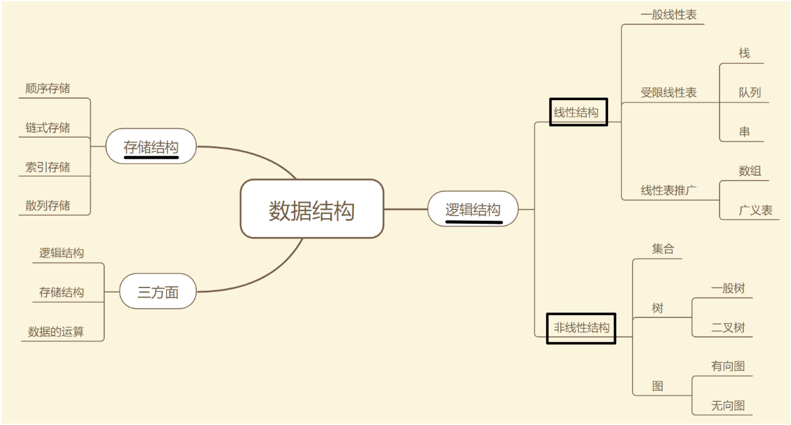

# 数据结构与算法



## 数据结构的基本操作(遍历+访问)

对于任何数据结构，其基本操作无非 **遍历+访问**，再具体一点就是：**增删查改**。

数据结构种类很多，但它们存在的目的都是在不同的应用场景，尽可能高效地增删查改。

如何遍历 + 访问？

宏观来看，各种数据结构的 **遍历+访问** 无非两种形式：线性的和非线性的。

- 线性：for/while 迭代为代表
- 非线性：递归为代表。

再具体一步，无非以下几种框架：

### 数组遍历框架

典型的线性迭代结构

```java
public void traverse(int[] arr) {
    for (int i = 0; i < arr.length; i++) {
        // 迭代访问
        System.out.println(i);
    }
}
```

### 链表遍历框架

兼具线性迭代和递归结构：

```java
public void traverse(ListNode head) {
    // 迭代访问
    for (ListNode p = head; p != null; p = p.next) {
        System.out.println(p.val);
    }
}
```

```java
public void traverse(ListNode head) {
    // 递归访问
    if (head == null) {
        return;
    }
    // 前序
    traverseLinear2(head.next);
    // 后序
}
```

### 二叉树遍历框架

典型的非线性递归遍历结构：

```java
public void traverse(TreeNode root) {
    if (root == null) {
        return;
    }
    // 前序
    traverse(root.left);
    // 中序
    traverse(root.right);
    // 后序
}
```

### N叉树遍历框架

二叉树框架拓展为**N叉树遍历框架**：

```java
public void traverse(TreeNode root) {
    for (TreeNode child : root.children){
        traverse(child);
    }
}
```

### 图的遍历

N 叉树的遍历又可以扩展为图的遍历:

- 因为图就是好几 N 叉棵树的结合体。
- 图是可能出现环的？ 用个布尔数组 visited 做标记就行了。

所谓框架，就是套路。

不管增删查改，这些代码都是永远无法脱离的结构。

把这个结构作为大纲，根据具体问题在框架上添加代码就行了。

## 算法刷题指南

1. 先学习像**数组、链表**这种基本数据结构的常用算法
2. 学会基础算法之后，不要急着上来就刷回溯算法、动态规划这类笔试常考题，而应该先刷**二叉树**

因为二叉树是最容易培养框架思维的，而且大部分算法技巧，本质上都是**树的遍历问题**。

**你就会发现只要涉及递归的问题，都是树的问题。**

```java
public void traverse(TreeNode root) {
    // 前序位置
    traverse(root.left);
    // 中序位置
    traverse(root.right);
    // 后序位置
}
```

综上，可以先刷树的相关题目，试着从框架上看问题，而**不要纠结于细节问题**。

- 纠结细节问题，比如纠结 i 到底应该加到 n 还是加到 n - 1，这个数组的大小到底应该开 n 还是 n + 1？

## 刷题心得-穷举

算法的本质就是「**穷举**」 

1. 如何穷举？即无遗漏地穷举所有可能解。
2. 如何聪明地穷举？即避免所有冗余的计算，消耗尽可能少的资源求出答案。

什么算法的难点在「如何穷举」呢？一般是递归类问题，最典型的就是动态规划系列问题。

- 动态规划等等

什么算法的难点在「如何聪明地穷举」呢？一些耳熟能详的非递归算法技巧，都可以归在这一类。

- 并查集，贪心等等

## 数据结构

