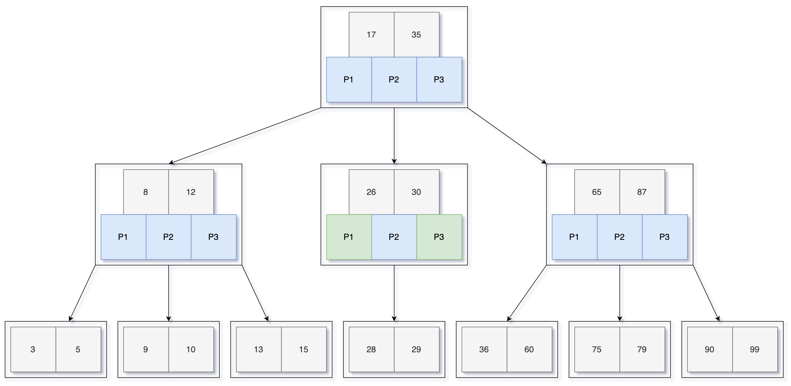
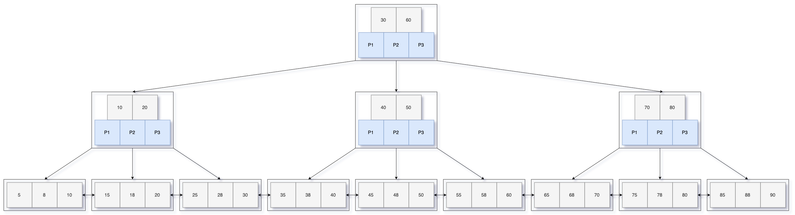

# 二叉树

## 二叉树的性质

1. 节点的最大层次称为树的深度或高度
2. 二叉树第 i 层 至多有 2^(i-1) 个节点
3. 深度为k的二叉树至多有2^k- 1 个节点
4. 任何一颗二叉树，终端节点数为n0，度为2的节点数为n2，则n0 = n2 + 1 
5. n个节点的完全二叉树的深度为 ⌊logn⌋  +1 

## 满二叉树

对于编号为 i 的结点

- 若有双亲，双亲为 ⌊i/2⌋
- 若有左孩子，左孩子为 2i
- 若有右孩子，右孩子为 2i+1

## 完全二叉树

1. 深度为 ⌊logn⌋  +1 
2. 若 i 小于等于 ⌊n/2⌋  ，则 i 为分支结点，否则为叶子结点
3. 度为1的结点 ，只可能有一个，且只有左孩子、无右孩子
4. n为奇数：分支结点都有左孩子、右孩子
5. n为偶数：编号最大的分支结点（编号⌊n/2⌋）有左孩子，无右孩子
6. n个节点的完全二叉树，最后一个结点是 ⌊n/2⌋结点的孩子
7. 完全二叉树，可能是满二叉树，其子树：
   1. 有一棵一定是满二叉树
   2. 另一颗可能是满二叉树，也可能是完全二叉树

## 哈夫曼树

- 带权路径长度（Weighted Path Length, WPL）最小的二叉树，又称最优二叉树

## 二叉搜索树 BST

二叉搜索树（binary search tree，BST）

### 核心定义

1. **有序性**：若它的左子树不空，则**左子树上所有节点的值**均**小于**它的根节点的值。
2. **有序性**：若它的右子树不空，则**右子树上所有节点的值**均**大于**它的根节点的值。
3. **递归性**：它的左、右子树也分别为二叉搜索树。

这个定义是**递归的**，这意味着树中的每一个子树本身也是一个二叉搜索树。

### 核心特性

**中序遍历二叉搜索树，可以得到一个递增的有序序列。**

- **中序遍历**：先遍历左子树，再访问根节点，最后遍历右子树。
- 因为左子树 < 根 < 右子树，所以按“左-根-右”的顺序遍历，自然就是从小到大排列。

**时间复杂度**：平均情况 O(log n)，最坏情况O(n)。

**缺点**：普通的二叉搜索树（BST）在**极端情况下会退化成链表**。

**应用**：

- 直接基于 BST 的数据结构有 AVL 树，红黑树等等，拥有了自平衡性质，可以提供 logN 级别的增删查改效率。
- 还有 B+ 树，线段树等结构都是基于 BST 的思想来设计的。

## 平衡二叉搜索树 

平衡二叉搜索树（Balanced Binary Search Tree）

**核心思想：**

- **在插入和删除节点时，通过特定的“旋转”操作，主动调整树的结构，使其始终保持“平衡”，从而保证树的高度始终在对数级别。**
- **控制根节点的左子树和右子树的高度差**，从而将树的高度 `h` 维持在 `O(log n)`。

### AVL 树

**平衡条件**：每个节点的平衡因子（左子树高度 - 右子树高度）只能是 -1, 0, 1。

**操作**：

1. 插入/删除节点后，从该节点向上回溯，找到第一个不平衡的祖先节点。
2. 根据这个节点的不平衡情况（LL, RR, LR, RL），执行对应的旋转操作。

**优点**：**提供了最严格的平衡**，因此查找效率是所有平衡BST中最高的。对于查找操作密集的场景非常适用。

**缺点**：为了维持高度平衡，**插入和删除操作可能需要频繁旋转**，性能略有损耗。

### 红黑树

**平衡条件**（通过5条规则定义）：

1. 每个节点非红即黑。
2. 根节点是黑色。
3. 所有叶子节点（NIL空节点）是黑色。
4. **红色节点的两个子节点必须是黑色**（即不能有连续的红色节点）。
5. 从任一节点到其每个叶子节点的所有路径都包含**相同数目的黑色节点**（即“黑高”相同）。

通过上述规则来确保**从根到叶子的最长路径不超过最短路径的2倍**。

**操作**：插入和删除节点时，可能会破坏上述规则（尤其是规则4）。需要通过**重新着色**和**旋转**来修正。其调整策略比AVL树更复杂，但调整次数通常更少。

**优点**：**插入和删除操作的效率更高**，因为不需要像AVL树那样追求绝对平衡，旋转次数更少。是一种一种折中的方案。

**缺点**：没有AVL树那么平衡，平均查找效率略低于AVL树。

**应用**：**极其广泛**。`C++ STL` 中的 `map`, `set`；`Java` 中的 `TreeMap`, `TreeSet`；`Linux` 内核的进程调度等都用的是红黑树。

## BST和BBST对比

| 特性              | 普通二叉搜索树           | AVL 树                                 | 红黑树                                        |
| :---------------- | :----------------------- | :------------------------------------- | :-------------------------------------------- |
| **平衡严格度**    | 无保证，可能退化         | **严格平衡**（高度差≤1）               | **近似平衡**（最长路径≤2倍最短路径）          |
| **查找效率**      | 平均 O(log n)，最坏 O(n) | **稳定 O(log n)**，**查找最快**        | 稳定 O(log n)，略慢于AVL                      |
| **插入/删除效率** | 平均 O(log n)，最坏 O(n) | 可能需要**频繁旋转**，效率较低         | **旋转次数较少**，效率更高                    |
| **适用场景**      | 不适用重要场景           | **大量查询，少量增删**（如数据库索引） | **大量增删**，或需要综合性能（如语言库的Map） |

1.  **空间换时间/操作换性能**：平衡BST通过**在插入和删除时付出额外的旋转开销**，来**换取查询时稳定的高效性能**。这是一种典型的权衡。
2.  **没有绝对的最优**：AVL树和红黑树各有优劣。如果你的应用**搜索非常频繁**，而插入删除操作不多，AVL树是很好的选择。如果你的**插入和删除操作也很频繁**，或者你需要一个**综合性能最优**的通用数据结构，红黑树是更流行的选择。这也是为什么你在标准库中看到的多是红黑树。
3.  **保证性能下限**：无论是AVL树还是红黑树，它们都保证了最坏情况下操作的时间复杂度仍然是 **O(log n)**，这是它们相对于普通BST最大的价值。

## 为什么需要 B 树？—— 背景与动机

B树是理解现代数据库和文件系统核心机制的基石。

在介绍B树之前，我们必须先理解它要解决的核心问题：**磁盘I/O效率**。

- **背景**：当数据量非常大时（比如数据库的索引），无法全部装入内存，必须存放在磁盘上。
- **瓶颈**：磁盘I/O（读写磁盘）的速度比内存访问**慢几个数量级**。因此，减少磁盘I/O次数是设计外部存储数据结构的首要目标。
- **二叉搜索树的局限性**：虽然平衡二叉搜索树（如AVL、红黑树）在内存中效率很高（O(log₂n)），但当数据在磁盘上时，每个节点可能位于不同的磁盘页（Page / Block）。每一次“比较”后向左或向右的遍历，都可能引发一次磁盘I/O。对于高瘦的二叉树来说，树的高度（h）就约等于最坏情况下的磁盘I/O次数。当数据量n极大时，log₂n 的高度仍然可能导致不可接受的磁盘I/O次数。

**B树的设计目标**：**最小化磁盘I/O次数**。它通过以下两个核心思想实现：

1. **变“高瘦”为“矮胖”**：不再是二叉，而是**多路分支**。一个节点可以拥有多个子节点（通常有成百上千个），这极大地降低了树的高度。
2. **节点大小 ≈ 磁盘页大小**：将一个B树节点的大小设计得恰好等于或略小于一个磁盘页（如4KB）。这样，一次磁盘I/O就可以读入一个包含大量键（Key）和指针（Pointer）的完整节点。在节点内部进行二分查找的速度极快（在内存中），成本可以忽略不计。

### B树定义

B树是一颗平衡的多路查找树 ，最大的孩子数目称为B树的阶，如：3阶B树、4阶B树等

一棵 **m阶** 的B树（B-tree of order m），是具有以下性质的树：

1. **节点子节点数限制**：
   - 每个节点最多有 **m** 个子节点。
   - 根节点至少可以有 **2** 个子节点（如果它不是叶子节点的话）。
   - 非根非叶的内部节点至少有 **⌈m/2⌉** 个子节点。（这个性质保证了节点的利用率）
2. **键的数量限制**：
   - 对于一个有 *k* 个子节点的非叶子节点，它包含 **k-1** 个键。
   - 根节点至少包含 **1** 个键。
   - 非根节点至少包含 **⌈m/2⌉ - 1** 个键。
3. **键的排列顺序**：
   - 所有键在一个节点内是**升序排列**的。
   - 对于一个键 `K_i`，其左子树中的所有键都 `小于` `K_i`，其右子树中的所有键都 `大于` `K_i`。（这是对二叉搜索树性质的扩展）
4. **叶子节点深度**：
   - 所有叶子节点都位于同一层。这体现了树的完美平衡。

示例：5

### 示例：3阶B树

1. **最大子节点数：**每个节点最多有 3 个子节点
2. **最大关键字数：**每个节点最多包含 2 个关键字
3. **最小关键字数：**根节点至少1个，其他节点至少1个关键字
4. **平衡性：**所有叶子节点都在同一层
5. **有序性：**节点内关键字按升序排列，左子树 < 关键字 < 右子树

## 为什么需要 B+ 树？—— B树的局限性

B+树是现代数据库和文件系统索引结构的绝对核心，

B树已经很好地解决了磁盘I/O的问题，但它仍有几个关键劣势，特别是在数据库场景下：

1. **范围查询效率低**：如果要查询一个范围内的所有数据（如`WHERE age BETWEEN 20 AND 30`），在B树中进行中序遍历非常低效，可能需要跨多个层级的节点进行多次随机磁盘I/O。
2. **查询性能不稳定**：由于数据（键值对）可能存储在内部节点，也可能存储在叶子节点，一次查询的磁盘I/O次数可能是一次（直接在根节点命中），也可能是`h`次（到叶子节点才命中），性能不稳定。
3. **空间利用率相对较低**：内部节点既要存储键（Key），也要存储数据（Data）或指针，这意味着同样大小的磁盘页，B树的内部节点能存储的键更少，导致树可能略高一些。

**B+树的设计目标**：在B树的基础上进行优化，**极致地适配数据库的查询需求**，特别是范围查询。

### B+ 树定义

一棵 **m阶** 的B+树（B+-tree of order m），是具有以下性质的树：

1.  **节点结构**：
    *   每个节点最多有 **m** 个子节点。
    *   每个节点（非根）至少有 **⌈m/2⌉** 个子节点。

2.  **键的数量**：
    *   对于一个有 *k* 个子节点的非叶子节点，它包含 **k** 个键（注意：这里是`k`个，而不是B树的`k-1`个）。
    *   非根节点至少包含 **⌈m/2⌉** 个键。

3.  **数据存储分离（最核心特性）**：
    *   **内部节点（非叶子节点）只存储键（Key）和子节点的指针**。它**不存储**实际的数据记录（Data）或指向数据记录的指针。
    *   **叶子节点存储所有键（Key）以及对应的数据记录（Data）或指向数据记录的指针**。

4.  **键的排列与顺序**：
    *   内部节点的键 `K_i` 是其子树上所有键的**最大值**或**上界**。它是其子树中最小键的副本，用于路由。
    *   所有键在节点内部有序排列。

5.  **叶子节点链表（另一核心特性）**：
    *   **所有叶子节点通过双向链表（或单向链表）按顺序连接起来**。这使得范围查询变得异常高效。

6.  **平衡性**：
    *   所有叶子节点都位于同一层，树是完全平衡的。

### 示例：3阶B+树

*   每个节点最多有 **3** 个子节点。
*   每个节点最多有 **3** 个键（内部节点键数=指针数）。
*   每个非根节点至少有 **⌈3/2⌉ = 2** 个子节点和 **2** 个键。

### 查找

查找分为两种：

*   **单值查找**：与B树类似，但从根节点到叶子节点的路径是唯一的，**必须走到叶子节点才能找到数据**。
*   **范围查找**：先找到范围的下界所在的叶子节点，然后利用叶子节点的**链表指针**，顺序向后遍历，直到超过上界。这个过程几乎不需要回溯到上层节点，性能极高。

---

### B+树和B树对比

| 特性             | **B树**                                                      | **B+树**                                                     |
| :--------------- | :----------------------------------------------------------- | :----------------------------------------------------------- |
| **数据存储位置** | **所有节点**都可能存储数据。                                 | **仅叶子节点**存储数据，内部节点纯索引。                     |
| **叶子节点连接** | 叶子节点间**无链接**。                                       | 叶子节点通过**双向链表**顺序连接。                           |
| **查询性能**     | 1. 等值查询性能**不稳定**（可能在内部节点命中）。 2. **范围查询性能极差**，需要复杂的中序遍历。 | 1. 等值查询性能**稳定**（必须到叶子节点）。 2. **范围查询性能极佳**，只需在链表上遍历。 |
| **空间利用率**   | 内部节点存储数据，同样阶数下**节点fan-out（扇出）更低**，树可能更高。 | 内部节点**仅存键**，**fan-out更高**，同样数据量下树更**矮胖**，I/O次数更少。 |
| **适用场景**     | 适用于既随机又范围的混合查询，或文件系统元数据管理。         | **数据库索引的绝对霸主**，特别适合大量范围查询的场景。       |

### 总结

**设计哲学**：B+树是B树的优化变种，其核心思想是**“将索引与数据完全分离”**，内部节点组成一个纯的、多层的**索引结构**，而所有数据都存储在顺序连接的**叶子节点**中。

**核心优势**：

1.  **极高的范围查询效率**（叶子节点链表）。
2.  **更稳定的查询性能**（每次查询都要走到叶子节点）。
3.  **更高的扇出和更矮的树**（内部节点只存键，一次I/O能加载更多键）。

**应用**：

*   **关系型数据库**：**MySQL（InnoDB）、PostgreSQL、Oracle、SQL Server** 等主流数据库的索引几乎无一例外地使用B+树。`CREATE INDEX` 语句背后创建的就是一棵B+树。
*   **非关系型数据库**：MongoDB的默认索引也是B+树。
*   **文件系统**：如NTFS、ReiserFS、XFS等使用B+树变种来管理磁盘块和目录结构。

可以说，B+树是为数据库而生的数据结构，是理论与实践完美结合的典范。

理解了B+树，你就拿到了深入理解数据库内部工作原理的钥匙。