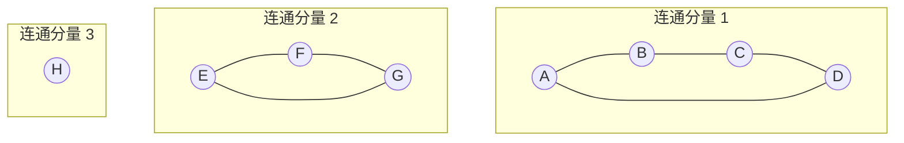
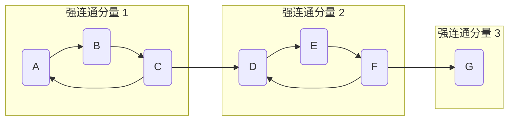

# 图

## 连通

在一个图中，任意两个顶点之间都存在一条**路径**（直接或间接相连），那么这个图就是连通的

## 连通分量

| 特性           | 描述                                                         |
| :------------- | :----------------------------------------------------------- |
| **适用对象**   | **无向图**                                                   |
| **核心思想**   | **极大的连通子图**                                           |
| **“极大”含义** | 不能再加入任何原图的其他顶点而保持连通                       |
| **特殊情况**   | 单个没有边的顶点也是一个连通分量                             |
| **相关概念**   | 有向图中对应的是**强连通分量**和**弱连通分量**               |
| **常用算法**   | **DFS（深度优先搜索）**、**BFS（广度优先搜索）**、**并查集** |

### 无向图

无向图 G 的一个**极大连通子图** 称为 G的一个连通分量。

满足条件：

- **本身是连通的**。
- **再加入任何其他额外的顶点和边，它就不再连通**。及找不到另一个连通的子图，它既包含当前这个子图，又比它大。

简单来说，连通分量就是图中的一个“**独立模块**”或“**孤岛**”，在这个模块内部所有点都是相通的，但这个模块与图的其他部分没有任何连接。

示例，**一个包含 3个连通分量 的无向图：**

- **分量1**: 顶点 {A, B, C, D} 形成一个环，它们之间是连通的。
- **分量2**: 顶点 {E, F, G} 形成一个三角形，它们之间是连通的。
- **分量3**: 孤立的顶点 {H}，自身构成一个分量。
- 这三个分量之间**没有任何边**连接，证明了“极大连通子图”的定义。

### 有向图

1. **强连通分量**
   - **定义**：在一个有向图的子图中，如果任意两个顶点 **u** 和 **v** 之间都存在一条从 **u** 到 **v** 的**有向路径**，同时也存在一条从 **v** 到 **u** 的**有向路径**，那么这个子图就是一个强连通分量。
   - **理解**：这意味着分量内的顶点是“双向互通”的。
2. **连通分量（弱连通分量）**
   - 如果忽略有向图中所有边的方向，将其视为无向图，然后找到的连通分量，就称为**弱连通分量**。

**通常，在没有特别说明的情况下，“连通分量”指的就是无向图中的概念。**

示例，**一个包含 3个强连通分量 的有向图：**

- **SCC1**: 顶点 {A, B, C} 形成一个有向环（A→B→C→A），它们之间是**强连通**的（任意两点可互达）。
- **SCC2**: 顶点 {D, E, F} 形成另一个有向环（D→E→F→D），它们之间也是强连通的。
- **SCC3**: 孤立的顶点 {G}，自身构成一个强连通分量。
- 分量之间有**有向边**连接（如 C→D, F→G），但这些边是单向的，不足以让两个分量合并为一个更大的强连通分量。

### 连通分量求解（算法）

寻找一个无向图的所有连通分量是图论中的一个基本问题，常用的算法是：

- **深度优先搜索** 或 **广度优先搜索**
- **并查集**

**DFS/BFS 的基本思路如下：**

1. 初始化一个访问标记数组，记录所有顶点是否已被访问过。
2. 从头开始遍历所有顶点。
3. 当遇到一个**未被访问**的顶点时，就从它开始进行一次**DFS**或**BFS**。
4. 这次**DFS**或**BFS**所能遍历到的**所有顶点**，就共同构成了**一个连通分量**。
5. 重复步骤3和4，直到图中所有的顶点都被访问过。

## 存储图