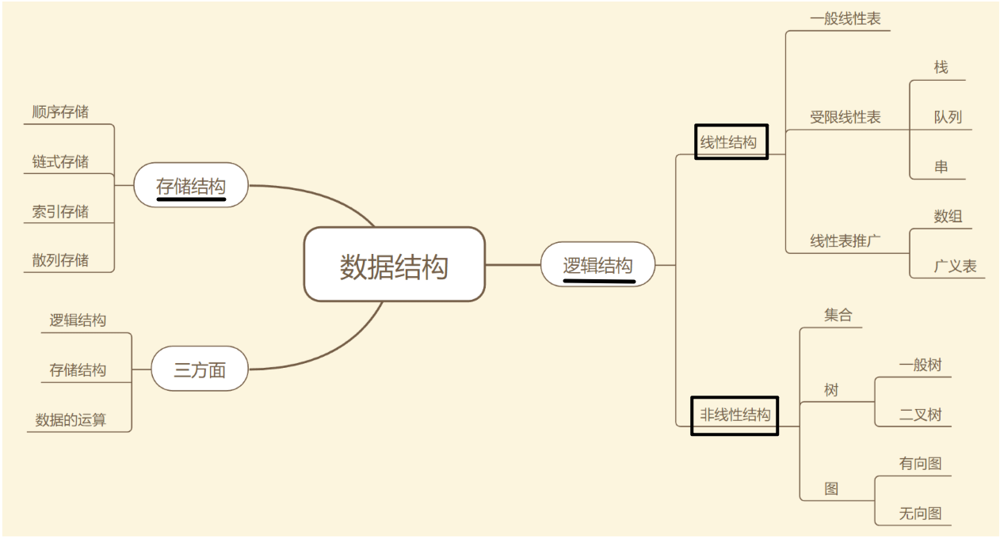
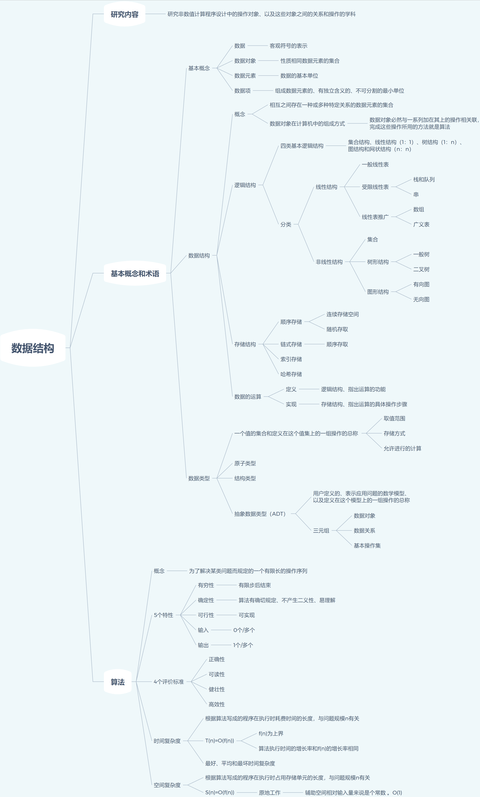

# 数据结构与算法

## 数据结构的基本操作

对于任何数据结构，其基本操作无非 **遍历+访问**，再具体一点就是：**增删查改**。

数据结构种类很多，但它们存在的目的都是在不同的应用场景，尽可能高效地增删查改。

如何遍历 + 访问？

宏观来看，各种数据结构的 **遍历+访问** 无非两种形式：线性的和非线性的。

- 线性： for/while 迭代为代表
- 非线性：递归为代表。

再具体一步，无非以下几种框架：

数组遍历框架，典型的线性迭代结构：

链表遍历框架，兼具迭代和递归结构：

二叉树遍历框架，典型的非线性递归遍历结构：

二叉树框架拓展为N叉树遍历框架：

N 叉树的遍历又可以扩展为图的遍历：

- 因为图就是好几 N 叉棵树的结合体。
- 图是可能出现环的？ 用个布尔数组 visited 做标记就行了

所谓框架，就是套路。不管增删查改，这些代码都是永远无法脱离的结构。

你可以把这个结构作为大纲，根据具体问题在框架上添加代码就行了

## 算法刷题指南

## 刷题心得

## 数据结构

